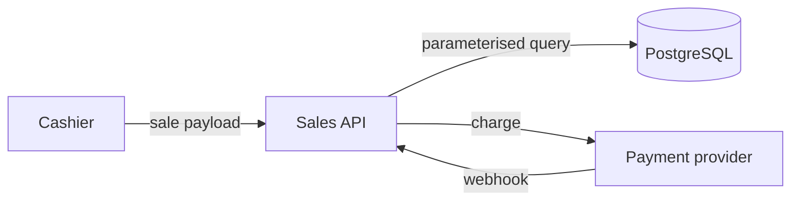

## Threat Modeling

Find the attacks while they are still design changes. After implementation the
same finding costs an order of magnitude more and often cannot be fixed properly
at all.

Composed of `trust-boundaries` (where controls belong) and `stride` (what can go
wrong). This skill is the process that wraps them.

### The four questions

Shostack's framing — the whole method reduces to these:

1. **What are we building?** — scope and data flow
2. **What can go wrong?** — threat enumeration
3. **What are we going to do about it?** — controls
4. **Did we do a good job?** — validation

### When to model

Model when the answer to any of these is yes:

- Does it authenticate, authorise, or manage identity?
- Does it move money, alter prices, or change stock?
- Does it handle personal or payment data?
- Does it accept input from outside the system, including third-party callbacks?
- Does it introduce a new trust boundary or a new external dependency?

Not every feature needs one. A model for a UI copy change is process theatre and
teaches the team to ignore the exercise.

### Method

**1. Scope — 15 minutes, written down**

One feature, not the whole system. State what is in scope, what is out, and what
you are assuming is already secure. Unscoped models produce documents nobody
reads.

**2. Describe the data flow**

External entities, processes, data stores, and the flows between them. A simple
diagram beats prose:



Mark trust boundaries on it — see `trust-boundaries`.

**3. Define the adversaries**

Be concrete about who, ordered by realistic likelihood. For a retail system:

1. A dishonest staff member with valid low-privilege credentials
2. A staff member of one shop reaching another shop's data
3. An attacker with stolen staff credentials
4. A customer interacting through any public surface
5. A compromised dependency running in the application process

The insider comes first deliberately. Most retail loss is internal, and models
that only consider anonymous attackers miss the threats that actually occur.

**4. Enumerate threats**

Apply `stride` per element. Express each as a concrete scenario, not a category.

**5. Specify controls**

Every threat gets a control, or an explicitly accepted risk with a named owner.
Prefer controls that are structural over controls that require discipline —
query-level tenant scoping beats "remember to filter".

**6. Rate and prioritise**

Likelihood × impact on the shared severity scale. Be honest; an inflated model
gets ignored, and then the real findings go unread too.

**7. Validate**

Hand abuse cases to QA as test cases. After implementation, confirm each required
control is present — a model whose controls were never verified provided
documentation, not security.

### Output

```markdown
# Threat Model: <feature>

## Scope           — in, out, assumptions
## Data Flow       — diagram with trust boundaries
## Adversaries     — ordered by likelihood
## Threats         — STRIDE table with scenario, rating, control
## Required Controls — the implementation checklist
## Accepted Risks  — risk, rationale, owner, review date
## Abuse Cases     — handed to QA
```

**Required Controls** is the deliverable engineering actually consumes. Everything
above it is the reasoning that produced it.

### Common failures

| Failure | Fix |
|---|---|
| Modeling after implementation | Move it before design sign-off |
| Scope too large | One feature; timebox it |
| Threats with no controls | A threat without a mitigation is unfinished |
| Only anonymous attackers | Put the insider first |
| Model written, never validated | Verify controls post-implementation |
| Theoretical threats | Ground each in a concrete, reachable attack path |

### Checklist

- [ ] Scope written, with assumptions stated
- [ ] Data flow diagrammed with trust boundaries
- [ ] Adversaries named and ordered, insider included
- [ ] STRIDE applied per element
- [ ] Every threat has a control or an owned accepted risk
- [ ] Ratings use the shared severity scale
- [ ] Required Controls list produced for implementation
- [ ] Abuse cases handed to QA
- [ ] Post-implementation verification scheduled

## References

- **Adam Shostack, _Threat Modeling: Designing for Security_** — the four
  questions and the overall process
- **OWASP Threat Modeling Cheat Sheet** — process steps and scoping guidance
  <https://cheatsheetseries.owasp.org/cheatsheets/Threat_Modeling_Cheat_Sheet.html>
- **Microsoft Threat Modeling guidance** — data flow diagrams and STRIDE
  application
  <https://learn.microsoft.com/en-us/azure/security/develop/threat-modeling-tool-getting-started>
- **Threat Modeling Manifesto** — values and principles
  <https://www.threatmodelingmanifesto.org/>
- **OWASP Top 10 (2021) A04 Insecure Design** — why design-time modeling matters
  <https://owasp.org/Top10/A04_2021-Insecure_Design/>

**Not sourced — written for this framework:** the when-to-model trigger list, the
retail adversary ordering, the common-failures table, and the Required Controls
output convention.
