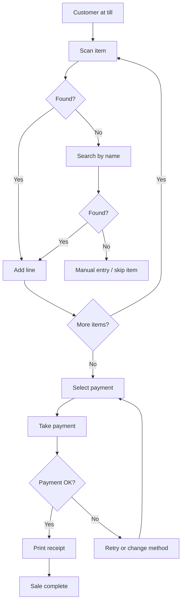

## User Flows

A flow is the path from intent to outcome. Mapping it before designing screens
prevents the most common failure: designing each screen well and the journey
badly.

### Map the whole path, including failure

Most flow diagrams show only the happy path — which is why error states get
designed last, or not at all.



Every decision node needs both branches designed. The "not found" and "payment
failed" branches are where staff get stuck, and they are exactly what an
untested design omits.

### Count and question the steps

For each step, ask:

- **Is it necessary?** Or is it there because the data model wanted it?
- **Can it be defaulted?** Most sales are cash, one shop, today's date.
- **Can it be deferred?** Customer details after payment, not before.
- **Can it be combined?** Two screens that always follow each other are one.

```
Current  Scan → Review → Choose payment → Confirm → Enter amount → Confirm → Receipt   (7)
Better   Scan → Pay (method + amount together) → Receipt                                (3)
```

**Count the steps on the frequent path.** On a till, each removed step is
thousands fewer interactions per month — see `usability-review`.

### Design the entry points

A flow rarely starts at step one. The same task is reached from a scan, a search,
a dashboard alert, a notification, or a direct link. Each entry must land the
user somewhere sensible with the right context.

For a POS, the till screen should be **deep-linkable** so a terminal can boot
straight into it.

### Design the exits

- **Success** — what happens next? Most flows should return to the start, ready
  for the next customer, not sit on a confirmation screen.
- **Cancel** — is it always available, and does it leave clean state?
- **Interruption** — a phone call mid-sale. Can the sale be held and resumed?
- **Abandonment** — what happens to a half-scanned basket? Losing it is a real
  cost.

### Branch by role

The same task differs by permission, and the difference belongs in the flow, not
in a runtime surprise.

```
Apply discount
  Cashier  → within limit → applied
           → over limit   → manager approval required   ← design this branch
  Manager  → any amount, reason required
```

Never design a flow that ends in a permission denial the user could not have
anticipated. Show the constraint before the effort — see `authorization`.

### Interruption and concurrency are part of the flow

Retail flows are interrupted constantly, and this is where real designs fail:

- A phone call mid-sale → hold and resume
- A customer changing their mind → remove a line, cheaply
- Stock running out during the sale → surface it at scan time, not at payment
- Another till selling the last unit → the failure must be recoverable at
  checkout
- Network dropping mid-payment → the flow must be resumable, not lost

### Optimise the frequent path, keep the rare path possible

Design decisions should follow frequency:

| Frequency | Design for |
|---|---|
| Every sale | Minimum steps, muscle memory, no confirmation |
| Several times a day | Reachable in one or two taps |
| A few times a week | Discoverable in a menu |
| Rare (annual close) | Guided and explicit; speed irrelevant |

Optimising a rare flow at the cost of a frequent one is a net loss, however
satisfying it is.

### Output

```markdown
## Flow: <task>
**Actor / role**  **Entry points**  **Goal**
### Happy path      — numbered steps with interaction count
### Decisions       — each branch, both outcomes
### Errors          — what fails, what the user sees, how they recover
### Interruptions   — hold, resume, abandon
### Exits           — success, cancel, timeout
### Step count      — current vs target
### Open questions
```

Hand to `ui-design` for screen composition and to `acceptance-criteria` so each
branch becomes a testable scenario.

### Checklist

- [ ] Whole path mapped, not only the happy path
- [ ] Every decision node has both branches designed
- [ ] Steps counted; each questioned for necessity
- [ ] Defaults applied to the common case
- [ ] Entry points identified and given correct context
- [ ] Success exit returns the user to a useful place
- [ ] Cancel available throughout, leaving clean state
- [ ] Hold-and-resume designed for interruptions
- [ ] Role branches designed, with constraints shown before effort
- [ ] Concurrency and network failure paths recoverable
- [ ] Frequent paths optimised over rare ones
- [ ] Handed to design and to acceptance criteria

## References

- **Nielsen Norman Group — User Journeys vs User Flows; Flow Diagrams**
  <https://www.nngroup.com/articles/user-journeys-vs-user-flows/>
- **Nielsen Norman Group — Error prevention and recovery heuristics**
  <https://www.nngroup.com/articles/ten-usability-heuristics/>
- **Agente Studio — POS design principles** — reducing steps per transaction and
  supporting multiple lookup paths
  <https://agentestudio.com/blog/design-principles-pos-interface>
- **Creative Navy — POS design guide** — conversational ordering; letting the
  operator follow the customer's sequence
  <https://medium.com/uxjournal/the-design-principles-in-the-pos-system-pos-design-guide-part-2-57d1bcb30ac0>

**Not sourced — written for this framework:** the retail interruption cases, the
frequency-to-design table, the role-branch rule about showing constraints before
effort, and the output template.
